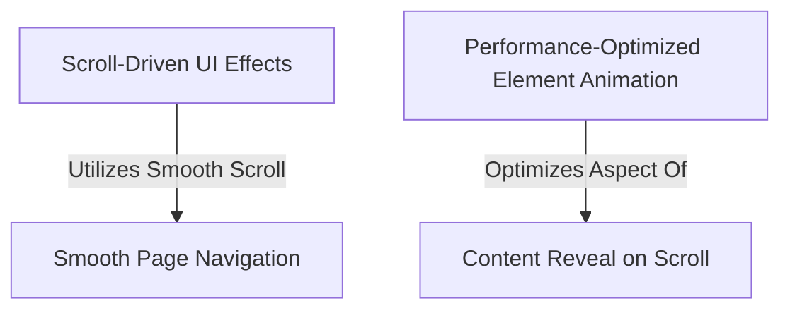

# Tutorial: Project-Portfolio

This project is a personal *portfolio website* designed to create a **dynamic and smooth browsing experience**. It intelligently **adapts the user interface** as you scroll, like making the navigation bar appear differently or revealing a handy 'scroll to top' button. Content on the page **gracefully fades or slides into view** as you discover it, and navigation within the page happens with **gentle, smooth transitions**. Crucially, it uses **efficient techniques** to animate elements like skill bars, ensuring the website remains **fast and responsive**.

## Visual Overview

## Chapters

1. [Content Reveal on Scroll
](01_content_reveal_on_scroll_.md)
2. [Performance-Optimized Element Animation
](02_performance_optimized_element_animation_.md)
3. [Smooth Page Navigation
](03_smooth_page_navigation_.md)
4. [Scroll-Driven UI Effects
](04_scroll_driven_ui_effects_.md)

---

Generated by [AI Codebase Knowledge Builder](https://github.com/The-Pocket/Tutorial-Codebase-Knowledge).
